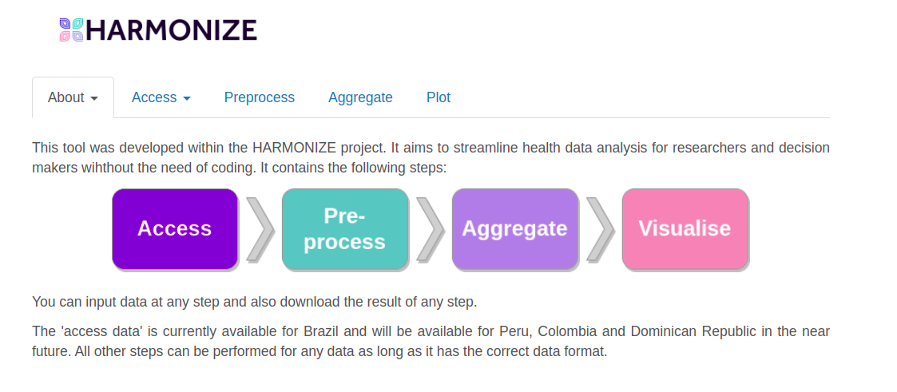
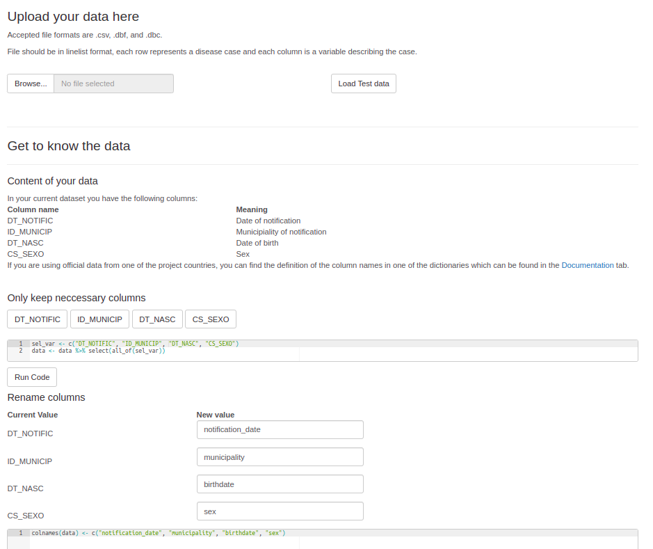
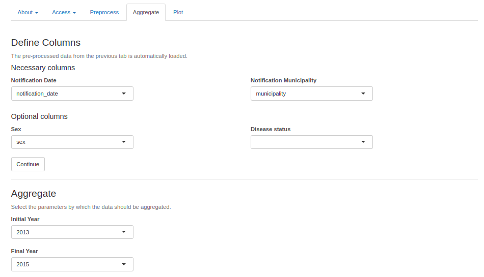
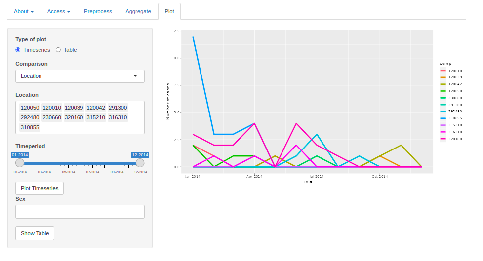

# data4health <a href='https://www.harmonize-tools.org/'></a>

<!-- badges: start -->
[](https://lifecycle.r-lib.org/articles/stages.html#experimental)
[](https://www.gnu.org/licenses/gpl-3.0)
<!---
[](https://github.com/harmonize-tools/data4health/graphs/contributors)

-->
<!-- badges: end -->

## Overview
<p style="font-family: Arial, sans-serif; font-size: 14px;">

  data4health is a tool developed as part of the HARMONIZE project to facilitate the access, preprocessing, and aggregation of health data at customized spatiotemporal resolutions. Originally designed for data from Colombia, Brazil, Peru, and the Dominican Republic, the tool is intended to be adaptable for any linelist health data.

The R package and offers two modes of operation based on the user's coding experience:
<ul>
  <li> For users with <b>coding experience</b>: A wide range of functions can be directly used within R. </li>
  <li> For <b>non-coding users</b>: A graphical user interface (GUI) guides users through the data processing pipeline in an intuitive, user-friendly way. </li>
</ul>

Key Features of the R Package:

<ul>
  <li> Instructions on how to access health data </li>
  <li> Functions for cleaning and preprocessing health data </li>
  <li> Spatial harmonization, allowing aggregation to any coarser administrative unit </li>
  <li> Temporal harmonization, enabling aggregation to epidemiological weeks or months </li>
  <li> Data visualization capabilities</li>
  <li> Output as a .csv file, formatted to meet user-specified requirements</li>
</ul>

</p>


## Dependencies

<table>
  <tr>
    <td align="center">
      <a href="https://cran.r-project.org/web/packages/dplyr/index.html" target="_blank">
        
      </a>
    </td>
    <td align="left">
      <strong>dplyr</strong><br>
      Provides a set of tools for efficiently manipulating datasets in R.<br>
    </td>
  </tr>
  <tr>
    <td align="center">
      <a href="https://cran.r-project.org/web/packages/ggplot2/index.html" target="_blank">
        
      </a>
    </td>
    <td align="left">
      <strong>ggplot2</strong><br>
      Used for creating complex plots from data in a data frame.<br>
    </td>
  </tr>
  <tr>
    <td align="center">
      <a href="https://cran.r-project.org/web/packages/shiny/index.html" target="_blank">
        
      </a>
    </td>
    <td align="left">
      <strong>shiny</strong><br>
      Facilitates building interactive web apps straight from R.<br>
    </td>
  </tr>
  
  <tr>
    <td align="center">
      <a href="https://rstudio.github.io/leaflet/" target="_blank">
        
      </a>
    </td>
    <td align="left">
      <strong>leaflet</strong><br>
      Leaflet makes it easy to create mobile-friendly interactive maps from R. <br>
    </td>
  </tr>
  
  <tr>
    <td align="center">
      <a href="https://lubridate.tidyverse.org/" target="_blank">
        
      </a>
    </td>
    <td align="left">
      <strong>lubridate</strong><br>
      Lubridate makes it easier to do the things R does with date-times and possible to do the things R does not.<br>
    </td>
  </tr>
</table>

If not yet installed, users can install dependencies with the following lines.
```r
packages <- c("dplyr", "DT", "foreign",  "ggplot2", "lubridate", "leaflet",
               "shinyWidgets", "shiny", "shinycssloaders",  "sf", "zoo", "read.dbc")
devtools::install_github("danicat/read.dbc")
install.packages(setdiff(packages, rownames(installed.packages())), repos = "http://cran.us.r-project.org")
```

<!---
## Installation

You can install the latest version of the package from GitHub using the `remotes` package:

```R
# Install remotes if you haven't already
install.packages("remotes")

# Install the package from GitHub
remotes::install_github("your_username/your_package_name")
```
-->

## How to Use it / Vignette

There are two main functionalities of data4health. For code-experienced users, a series a functions to support health data analysis are provided that useres can implement to simplify their existing data pipeline. Users with less code experience can employ the graphic user interface to clean and aggregate their data in a user friendly way.

<details>
<summary>
 Functions
</summary>
  
#### Cleaning

Before running the script, ensure you have the necessary packages installed. You can install them using the following commands:

```r
clean_data()
```

#### Aggregating
```r
aggregate_data()
```

#### Visualise
```r
plot_map()
```
</details>
<details>
<summary>
Graphic user interface
</summary>

#### Load GUI
Once data4health is loaded, the user interface can be loaded with the following command:

```r
library(data4health)
run_gui()
```
A browser window will automatically open, and the landing page will look like this:



#### Clean



#### Aggregate



#### Visualise



</details>

## Resources

<details>
<summary>
Other HARMONIZE tools
</summary>

HARMONIZE collates existing multi-source climate, environmental, socio-economic and health data, as well as collects new longitudinal ground-truth data using drone technology and low-cost weather sensors. Each data source has its own digital toolkit to allow local researchers and users, to prepare, interrogate and eventually merge the data spatio-temporally, to understand the links between environmental change and infectious disease risk in their local context, and to build robust early warning and response systems in low-resource settings. the other toolkits are:
<ul>
  <li> [clim4health]("https://github.com/harmonize-tools/clim4health") </li>
  <li> [land4health](https://github.com/harmonize-tools/land4health) </li>
  <li> [drone4health](https://github.com/harmonize-tools/drone4health) </li>
  <li> [socio4health](https://github.com/harmonize-tools/socio4health) </li>
</ul>

</details>

<!---
<details>
<summary>
Package Website
</summary>

The [`example` website](https://cran.r-project.org/) package website includes a function reference, a model outline, and case studies using the package. The site mainly concerns the release version, but you can also find documentation for the latest development version.

</details>
-->
<details>
<summary>
Organisation Website
</summary>

[Harmonize](https://www.harmonize-tools.org/) is an international develop cost-effective and reproducible digital tools for stakeholders in hotspots affected by a changing climate in Latin America & the Caribbean (LAC), including cities, small islands, highlands, and the Amazon rainforest.

The HARMONIZE digital toolkits will allow local researchers and users, including national disease control programs, to link, interrogate and use multi-scale spatiotemporal data, to understand the links between environmental change and infectious disease risk in their local context, and to build robust early warning and response systems in low-resource settings.

The project consists of resources and [tools](https://harmonize-tools.github.io/) developed in conjunction with different teams from Brazil, Colombia, Dominican Republic, Peru and Spain.

</details>
  
## Organizations

<table>
  <tr>
    <td align="center">
      <a href="https://www.bsc.es/" target="_blank">
        
      </a>
    </td>
    <td align="left">
      <strong>GHR</strong><br>
      Global Health Resilience
    </td>
  </tr>
</table>


## Authors / Contact information

List the authors/contributors of the package and provide contact information if users have questions or feedback.
</br>
</br>
<a href="https://github.com/Daniela-L">
  
</a>
<span style="display: flex; align-items: center; margin-left: 10px;">
  <strong>Daniela Lührsen</strong> (developer)
  <a href="https://orcid.org/0009-0002-6340-5964" style="margin-left: 10px;">
    
  </a>
</span>

<a href="https://github.com/drrachellowe">
  
</a>
<span style="display: flex; align-items: center; margin-left: 10px;">
  <strong>Raquel Lana</strong> (developer)
</span>

## Citation

- **APA Format:**
  - Lowe, R. (2020). *How to use the NetCDF files*. Package documentation. Retrieved from https://cran.r-project.org/).
